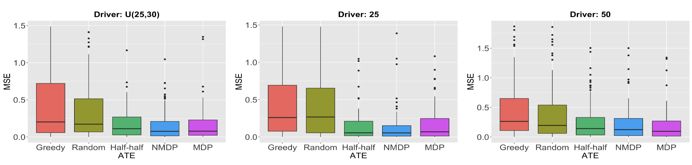

# Implementation for "Optimal Sequential Treatment Allocation for Efficient Policy Evaluation"

This repository contains the implementation for the paper "Optimal Sequential Treatment Allocation for Efficient Policy Evaluation" in python.

## Summary of the paper

A/B testing is critical  for modern technological companies to evaluate the effectiveness of newly developed products against standard baselines. This paperstudies optimal designs that aim to maximize the amount of information obtained from online experiments to estimate treatment effects accurately. We propose three optimal allocation strategies in a dynamic setting where treatments are sequentially assigned over time. These strategies are designed to minimize the variance of the treatment effect estimator when data follow a non-Markov decision process or a (time-varying) Markov decision process. We further develop estimation procedures based on existing off-policy evaluation (OPE) methods and conduct extensive experiments in various environments to demonstrate the effectiveness of the proposed methodologies.In theory, we prove the optimality of the proposed treatment allocation design and establish upper bounds for the mean squared errors of the resulting treatment effect estimators. 

**Figure 1**. This example contructs a  small-scale synthetic dispatch environment to estimate the treatment effect of different order dispatch policies. Specifically, we simulate drivers and orders in a $9 \times 9$ spatial grid with a duration of 20 time steps per day. All the methods are tested using 100 orders with the number of drivers being either generated from the uniform distribution $U(25, 30)$, or being fixed to 25, 50.  We investigate the proposed treatment allocation strategies designed for NMDPs and MDPs. We also implement the following three allocation designs for comparison. Random: uniform random treatment allocation design such that $\mathbb{P}(A_{i,t} = 1) = 1/2$. Half-half: the global treatment for the first $n/2$ days and the global control for the remaining days. Greedy: the $\epsilon$-greedy algorithms that select the current-best treatment, which maximizes the Q-function, with probability $1 - \epsilon$, and employs a uniform random policy with probability $\epsilon$.

## File Overview

- NTMDP.py: the estimation functions and the data generating function.
- NTMDP_simu.py: demo codes to run the experiment with respect to Example 5.3.
